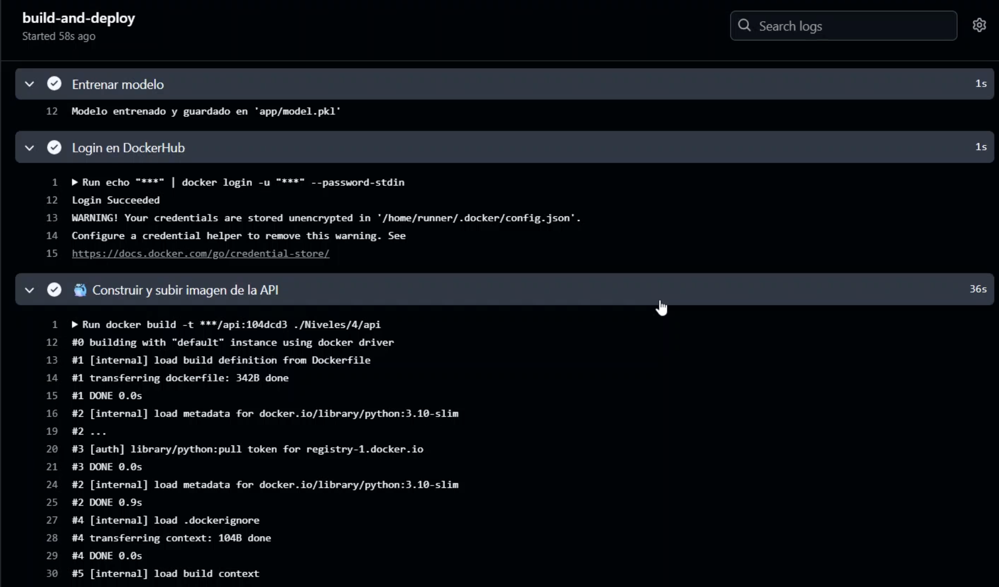
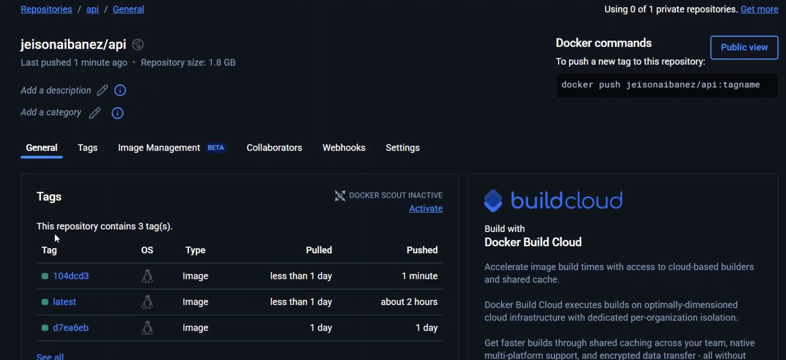

# TallerFinalMLops
Taller final de MlOps

El link para ver el video de este proyecto lo pueden encontrar acontinuacion:

https://youtu.be/NKM6mBAZye8

# MLOps-k8s
# Proyecto despliegue arquitectura Kubernets

Este proyecto es un sistema que permite tener un flujo limpio y automatico para el entrenamiento de modelos de ML y adicional en publicarlos a un ambiente productivo para que una api en este caso sea quien lo consuma

**La arquitectura solicitada es la siguiente**


**Solucion Presentada**

Para esta actividad contamos con 3 maquinas

- **10.43.101.184** Maquina de Jorge 
- **10.43.101.182** Maquina de Jeison
- **10.43.101.191** Maquina de Daniel

Y con esto proponemos la siguiente arquitectura


## Tecnologías Utilizadas

- **Python** Tecnologia utilizada para la creacion del api
- **Airflow** Tecnologia utilizada para orquestar los dags y dar manejo al entrenamiento de los modelos
- **Grafana** Tecnologia utilizada para el manejo y control de logs
- **Locust**  Tecnologia utilizada para realizar pruebas de carga sobre el **api**
- **Minio** Tecnologia utilizada para contener los modelos entrenados
- **Mlflow** Tecnologia utilizada para llevar las estadisticas de los modelos
- **Mysql** Tecnologia utilizada para persistir datos
- **Prometheus**  Tecnologia utilizada para obtener metricas del api
- **Streamlit**  Tecnologia utilizada para ejecutar su responsabilidad de frontend


## 📁 Estructura del Proyecto

```
 ├── config/       # Archivos de configuración (ConfigMaps, variables de entorno, etc.)
 ├── deployment/   # Definiciones de despliegue (Deployments, ReplicaSets)
 ├── pvc/          # Volúmenes persistentes (PersistentVolumeClaims)
 ├── service/      # Se   rvicios (ClusterIP, LoadBalancer, NodePort)
```


## 📦 Carpetas

### 🔧 `config/`
Contiene archivos YAML para la configuración general de la aplicación. Ejemplo:

```yaml
# config/configmap.yaml
apiVersion: v1
kind: ConfigMap
metadata:
  name: app-config
data:
  APP_ENV: "production"
  LOG_LEVEL: "debug"
```

### 🚀 `deployment/`
Define cómo se despliega la aplicación. Ejemplo:

```yaml
# deployment/deployment.yaml
apiVersion: apps/v1
kind: Deployment
metadata:
  name: my-app
spec:
  replicas: 2
  selector:
    matchLabels:
      app: my-app
  template:
    metadata:
      labels:
        app: my-app
    spec:
      containers:
        - name: my-container
          image: my-image:latest
```

### 💾 `pvc/`
Gestión del almacenamiento persistente. Ejemplo:

```yaml
# pvc/pvc.yaml
apiVersion: v1
kind: PersistentVolumeClaim
metadata:
  name: app-storage
spec:
  accessModes:
    - ReadWriteOnce
  resources:
    requests:
      storage: 1Gi
```

### 🌐 `service/`
Define cómo exponer la aplicación. Ejemplo:

```yaml
# service/service.yaml
apiVersion: v1
kind: Service
metadata:
  name: my-app-service
spec:
  type: ClusterIP
  selector:
    app: my-app
  ports:
    - port: 80
      targetPort: 8080
```

---

## 🚀 Cómo aplicar los manifiestos

```bash
kubectl apply -f config/
kubectl apply -f pvc/
kubectl apply -f deployment/
kubectl apply -f service/
```

---

## Implementacion

Una vez definida la arquitectura se procedio a instalar K3s en las 3 maquinas utilizando el siguiente comando:


```bash
curl -sfL https://get.k3s.io | K3S_URL=https://10.43.101.184:6443 K3S_TOKEN=K108d171d2fed096b8c59554ccd9e68e257b3ee2ac7040ce1e45c3c1297acb42372::server:73be5b885e76e005326f7fc508265e05 INSTALL_K3S_EXEC="--node-name nodo-jeison" sh -
```

con este comando ligamos los nodos a la maquina principal y le damos permiso de control del nodo para esto los nodos creados fueron los siguientes:


Una vez configurados los nodos todos los despliegues se realizan desde el control plane.

Por eso creamos estructura de despliegues utilizando las siguientes carpetas


## GitHub Actions

El repositorio del API y configurado con el proceso de GitHub Action, lo pueden encontrar en el siguiente link

```bash
https://github.com/Jeizz/Taller_CI_CD
```

Durante este proceso, lo que hacemos es realizar un pequeño cambio en el codigo, para esto, disponemos de un api que nos retorna el numero de version por medio de un api get como el siguiente:


Con esta version procedemos a cambiar por la siguiente version:


Una vez realizado esto procedemos a generar un commit directamente al repositorio para que inicie el proceso del action:


Posterior a esto vamos a ver el repositorio de GIT que referencie al inicio donde se configura todo el action para el despliegue del nuevo pod


Luego de esto revisamos los step como se van ejecutando



Y luego al finalizar todos los pasos se ejecutaron correctamente:


## Docker hub

Una vez finalizado esto procedemos a ver DockerHub donde se debe encontrar la nueva imagen generada automaticamente



Con esto podemos ver como se creo la imagen de manera automatica sobre el repositorio de Docker Hub.

## Despliegue automatico de Pod

Cuando ya tenemos la imagen desplegada en Docker Hub, el proceso automatico del Action despliega el pod sobre el nodo maestro de Kubernets para traer la ultima version generada:


Y luego cuando termina de levantarlo, procede a eliminar el anterior y dejar solo el nuevo


## Prueba del nuevo api desplegado

Una vez levantado todo el servicio procedemos a probar el api utilizando el servicio de version


# Configuracion AirFlow

Ahora procedemos a configurar AirFlow con el fin de obtener los datos del api que el proceso expuso, para esto definimos los siguientes paso configurados en los Dags

- **Clean DB** Limpieza de la bd para tener tablas limpias
- **Load Data** Proceso para obtener los datos expuestos por el profesor
- **PreProcess** Proceso para preprocesar los datos y limpiarlos segun lo necesario
- **Train** Proceso de entrenamiento y validacion del modelo entrenado
- **Send MLFlow** Proceso de envio del modelo entrenado a MLFlow

Para esto se observa las siguientes etapas configuradas en AirFlow como se ven en la grafica


Estos pasos nos permiten dar solucion a todo el proceso de entrenamiento y publicacion del modelo sobre MLFlow

## MLFlow

En MLflow se recibe el entrenamiento y el artefacto del entrenamiento para persistirlo y dejarlo publicado hacia produccion como segun se requiere para no dejarlo quemado en el codigo


## MiNio

Una vez esto llega a MLFlow sobre MiNio se recibe el artefacto a validar, por esto revisamos el bucket para ver el artefacto entrenado


## Ejecucion

Una vez todos los pods se han generado desde el control plane se ve lo siguiente


#Front end
Cuando ejecutamos la aplicacion se ve de la siguiente manera


